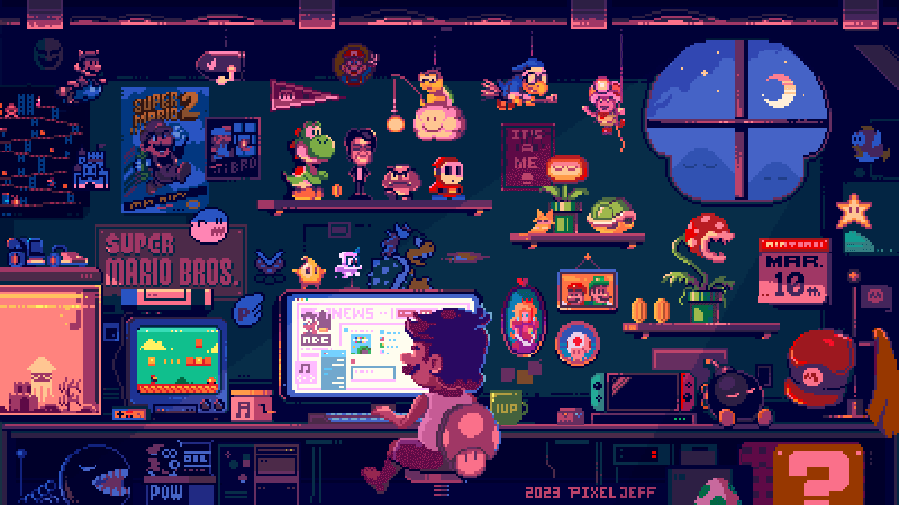

   

  
  

 

## 

> 📜 **`[PLAYER PROFILE & INVENTORY]`**
>
> * 🧙‍♂️ **Class:** Informatics Student (Sub-class: *Tech Explorer* & *Digital Creative*).
> * 🏰 **Guild:** Gunadarma University (Main base for grinding EXP and surviving sleep deprivation).
> * 🗺️ **Current Quest:** Exploring the vast lands of Web Development.
> * ✨ **Special Skills:** Master of *Advanced Googling*, divine-level StackOverflow copy-pasting, and nodding confidently while reading documentation.
> * 🧪 **Buff Item:** Hi-Res Lossless audio tracks (+50% Focus, -20% Stress).
> * 💀 **Cursed Item:** A smartphone that randomly freezes and reboots itself during critical moments.
> * 💥 **Weakness:** Bugs with no error messages and sudden boss fights (deadlines).

 

## 

### 🛠️ Programming & Frameworks
       

### ☁️ Cloud & Databases
  

### 🎨 Design & Others
  

 

## 

> 📊 **`[CHARACTER ATTRIBUTES & MAGIC SPELLS]`**
> My EXP grinding track record on the GitHub servers, along with the programming languages I cast the most in my repositories.

  

 
